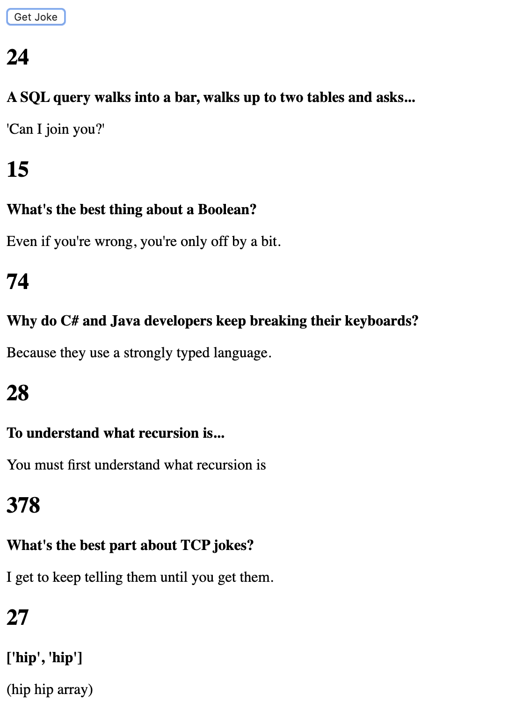

# API-Example - get Jokes

work with DOM.

There is an issue with this project: I don't want all the jokes to be concatenated on the UI. Instead, each time you click on "Get Jokes," 10 new jokes should be displayed on the screen.

